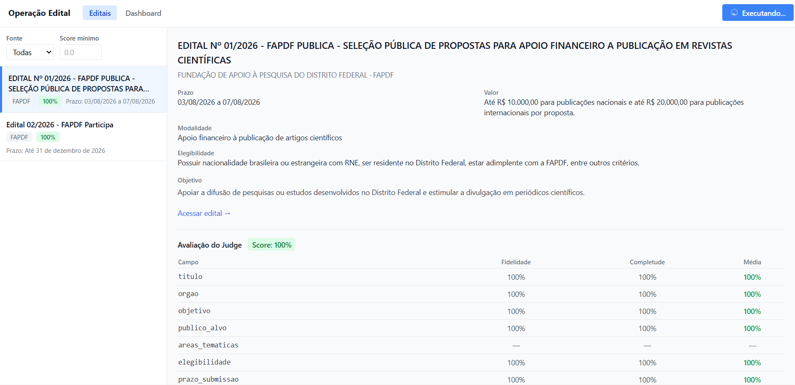

# Operação Edital — POC



Pipeline de extração, estruturação e visualização de editais de fomento. Acessa três fontes reais (FAPDF, FUNCAP, CAPES), extrai os PDFs dos editais, usa um LLM para estruturar as informações em campos padronizados e expõe os resultados via API REST + frontend React.

---

## Arquitetura

```
scrape → extrai PDF → LLM estrutura → valida Pydantic → LLM judge → JSON → API → React
```

| Camada | Tecnologia | Função |
|--------|-----------|--------|
| Scrapers | httpx + BS4 / Playwright / Firecrawl | Navegação e coleta de links |
| Extração | pdfplumber | Texto bruto dos PDFs |
| Estruturação | GPT-4o (fallback: Claude Sonnet) | Preenchimento dos campos padronizados |
| Avaliação | GPT-4o (LLM-as-a-judge) | Score de qualidade por campo |
| API | FastAPI + uvicorn | Endpoints REST |
| Frontend | React 18 + Vite + Tailwind | Visualização e dashboard |

### Estratégia por fonte

| Fonte | Estratégia | Motivo |
|-------|-----------|--------|
| FAPDF | httpx + BeautifulSoup | WordPress estático com accordion JS |
| FUNCAP | httpx + BeautifulSoup | WordPress estático |
| CAPES | Firecrawl | Portal gov.br renderizado via JS |

---

## Pré-requisitos

- Python 3.13+
- Node.js 18+ (apenas para o frontend)
- Chaves de API: OpenAI, Anthropic (fallback), Firecrawl (scraper CAPES)

---

## Instalação

### 1. Clone e crie o ambiente Python

```bash
git clone <repo>
cd operation-public-notice

python -m venv .venv
# Windows:
.venv\Scripts\activate
# Linux/Mac:
source .venv/bin/activate

pip install -e ".[dev]"
```

### 2. Instale os browsers do Playwright

```bash
playwright install chromium
```

> Necessário para o scraper da FAPDF (accordion JS).

### 3. Configure as variáveis de ambiente

Crie um arquivo `.env` na raiz do projeto:

```env
OPENAI_API_KEY=sk-...
ANTHROPIC_API_KEY=sk-ant-...
FIRECRAWL_API_KEY=fc-...
```

### 4. (Opcional) Instale as dependências do frontend

```bash
cd frontend
npm install
cd ..
```

---

## Como executar o pipeline

### Execução direta

```bash
python main.py
```

O pipeline irá:
1. Buscar editais nas três fontes configuradas
2. Baixar e extrair o texto dos PDFs
3. Estruturar cada edital via LLM (GPT-4o com fallback para Claude)
4. Avaliar a qualidade da extração com um LLM judge
5. Tentar correção automática se o score for inferior a 0.6
6. Salvar os resultados em `output/`

Os resultados parciais são escritos a cada edital processado — não é necessário aguardar o fim do pipeline para consultar os dados.

### Via API (com frontend)

```bash
# Terminal 1 — API
uvicorn api.main:app --reload

# Terminal 2 — Frontend (desenvolvimento)
cd frontend && npm run dev
```

Acesse `http://localhost:5173`.

Para disparar o pipeline pela interface:

```bash
curl -X POST http://localhost:8000/pipeline/run
```

Ou clique em **"Executar pipeline"** no frontend.

---

## Saída estruturada

Os resultados são salvos em `output/`:

### `output/editais.json`

Array de editais com os seguintes campos:

```json
{
  "id": "sha256(link_edital)[:12]",
  "titulo": "string",
  "orgao": "string",
  "objetivo": "string | null",
  "publico_alvo": ["string"],
  "areas_tematica": ["string"],
  "elegibilidade": "string | null",
  "prazo_submissao": "string | null",
  "valor_financiamento": "string | null",
  "modalidade_fomento": "string | null",
  "documentos_exigidos": ["string"],
  "criterios_avaliacao": "string | null",
  "cronograma": [{"evento": "string", "data": "string"}],
  "link_edital": "string",
  "link_pdf_principal": "string | null",
  "links_anexos": ["string"],
  "observacoes": "string | null",
  "fonte": "fapdf | funcap | capes",
  "extraido_em": "ISO datetime"
}
```

Campos não encontrados retornam `null` — nunca string vazia.

### `output/evaluation.json`

Array de avaliações por edital, com score por campo (fidelidade + completude), score geral, flags determinísticas e rastreamento do modelo LLM utilizado.

### Endpoints da API

```
GET  /editais                  lista editais (filtros: ?fonte=, ?min_score=)
GET  /editais/{id}             edital + avaliação
GET  /evaluation               todas as avaliações
GET  /evaluation/summary       KPIs: score médio, uso de modelo, correções
GET  /pipeline/status          {"running": bool}
POST /pipeline/run             dispara pipeline em background
```

---

## Testes

```bash
pytest                          # testes unitários Python
cd frontend && npm test         # testes do frontend
```

Os testes de integração (scrapers reais) exigem acesso à internet e podem ser executados com:

```bash
pytest -m integration
```

---

## Decisões técnicas

### Scrapers desacoplados do orquestrador

Cada fonte é um arquivo isolado que implementa `BaseScraper`. Adicionar uma nova fonte exige apenas criar o scraper e registrá-lo em `config/sources.py` — o `main.py` não precisa ser alterado.

### LLM para extração estruturada

O texto bruto do PDF é enviado ao GPT-4o com um schema fixo e instrução para retornar JSON puro. A resposta é validada com `Pydantic`. Campos ausentes retornam `null`.

### LLM judge com correção multi-turn

Após a extração, um segundo LLM avalia campo a campo a fidelidade (o valor está no texto?) e a completude (alguma informação foi omitida?). Se o score geral for inferior a 0.6, o pipeline tenta uma correção automática com feedback dos campos problemáticos — uma única tentativa, sem loop.

### Fallback automático de provider

Se o GPT-4o falhar ou atingir limite de taxa, o sistema faz fallback transparente para o Claude Sonnet sem interromper o pipeline.

### Rate limiting proativo

O pipeline rastreia chamadas por minuto para cada provider e aguarda proativamente antes de estourar o limite, reduzindo erros 429. Configurável via `LLMConfig.rpm_openai` e `LLMConfig.rpm_claude`.

### PDFs longos

Textos acima de ~80k tokens (~320k caracteres) são truncados para as 15 primeiras páginas, com log obrigatório. O campo `text_truncated` na avaliação registra quando isso ocorreu.

### Sem banco de dados

Os JSONs em `output/` são a fonte de verdade. A API lê os arquivos a cada request. Adequado para POC; substituível por banco relacional sem alterar scrapers ou extratores.
